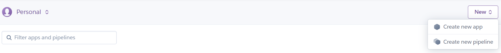
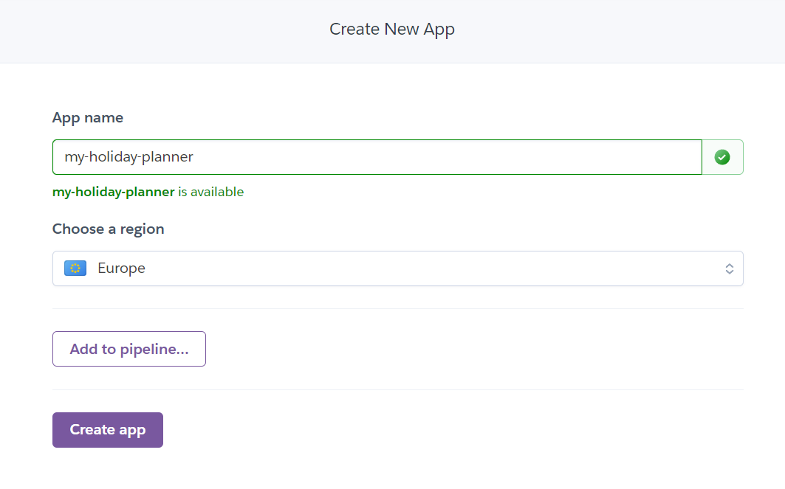
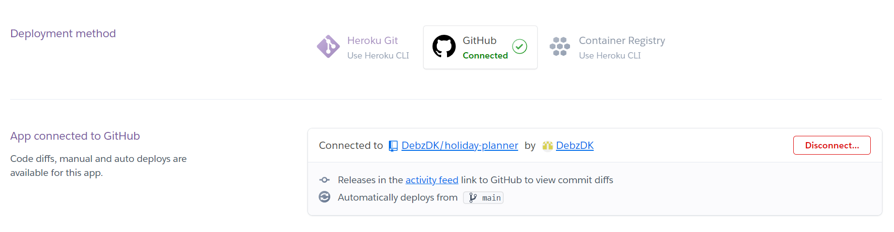
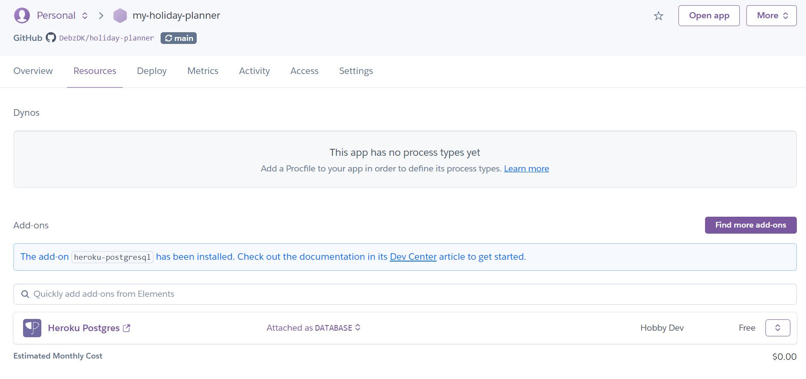
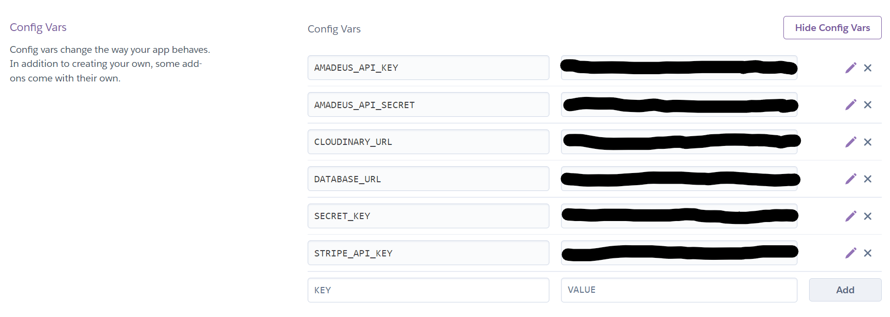
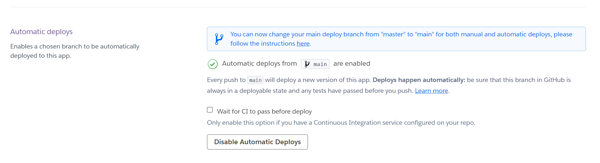
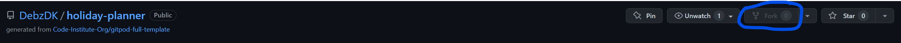

# Holiday Planner

'Holiday Planner' is a website that allows users to purchase flights and make hotel bookings separately or as a package deal. It aims to provide flight and hotel offers to users, allowing them to search by destination and order by the cheapest prices for the given dates. The site will be targeted toward people who are planning for a holiday.

<!-- TODO: -->

## Requirements

Before jumping into the design process, requirements needed to be specified in order to know exactly what the blog should achieve to meet the assessment criteria.

The following functional requirements were decided on:
1. The site must allow new users to sign up.
1. The site must allow existing users to log in and out.
1. The site must not permit access to restricted content prior to role-based login. 
1. The site must have an admin portal.
1. The site must display a navigable main menu.
1. The site must be responsive.
1. The site must allow users to perform CRUD operations on relevant models.
1. The site must allow payments.
1. The site must employ SEO and web marketing techniques.

## Design

Evidence for this section has been placed in its own .md file which can be found [here](https://github.com/DebzDK/holiday-planner/blob/main/DESIGN.md).

## Features

Each feature listed below was chosen for this project to achieve its goal and its functional requirements.

### Existing features

<!--TODO: Add images -->

* Home page

    * Collapsable main menu

    * Recent posts

* FAQ/Help page

* Flight search bar
    * Simple
    * Advanced

* User profile
    * Account

    * Stats

* Admin portal

### Future features

* Ability for users to reply to each other's comments on a blog post

    It would be nice if users were able to reply to each other within a nested thread of conversation.

* Ability for users to instant message one another

    This would be a nice way to promote a sense of community by allowing users to communicate with each other whenever they wanted and also to share their own recipes.

* Ability to send out an email to let users know when there's a new blogpost

    This would have been a cool feature to implement to make it feel more like a real blog site.

* Ability to report posts and comments

    This would have also been a feature to implement to make it feel more like a real blog site.

## Languages and technologies used

* Languages
    * [Python](https://en.wikipedia.org/wiki/Python_(programming_language)) - used to create the command line application
    * [CSS3](https://en.wikipedia.org/wiki/CSS) - used Cascading Style Sheets to style HTML
    * [Bootstrap](https://getbootstrap.com/) - used for responsive design
    * [JavaScript](https://en.wikipedia.org/wiki/JavaScript) - used to make webpages interactive
    * [jQuery](https://jquery.com/) - used for easy document tranversal and manipulation

* Technologies
    * [Adobe Color](https://color.adobe.com/) - used to create colour scheme for website
    * [Autoprefixer](https://autoprefixer.github.io/) - used to automatically add vendor prefixes for browser compatibility
    * [CompressJPEG](https://compressjpeg.com/) - used to compress all website images
    * [EZGIF](https://ezgif.com/) - used to create the GIFs used in this README
    * [Pexels](https://www.pexels.com/) - used to find free licence images
    * [Amadeus for Developers](https://developers.amadeus.com/) - used to provide free flight and hotel information from their test data 
    * [FlickR](https://www.flickr.com/) - used to get random images of destinations for display in the website
    * [Stripe](https://stripe.com/gb) - used to facilitate payments
    * [Django](https://www.djangoproject.com/) - used to build web app
    * [PostgresSQL](https://www.postgresql.org/) - used to store relational data
    * [Heroku](https://www.heroku.com/) - used to deploy project
    * [Git](https://git-scm.com/) - used for version control
    * [GitHub](https://github.com/) - used for internet hosting and version control through use of Git
    * [Gitpod](https://gitpod.io/) - used as online IDE for software development
        * The terminal was used to create branchs to work on before merging into the main branch. These branches have been preserved for the sake of the assessment, otherwise they would have been deleted after use.

        <!--TODO: -->

## Testing

Evidence for this section has been placed in its own .md file which can be found [here](https://github.com/DebzDK/baked-beauties-blog/blob/main/TESTING.md).

## Deployment

The application was deployed via [Heroku](https://www.heroku.com/) using the steps listed below:

1. In Heroku, click 'New' then 'Create app'.

    

1. Name the app and select your closest region.

    

1. Connect to Github and find the holiday-planner project.

    

1. Add Postgres add-on.

    

1. Set up configuration variables.

    

1. Choose either 'Enable Automatic Deployments' or 'Deploy' for manual deployments.

    *Note: Automatic deployments were enabled for this project.*

    

The live link can be found here - https://my-holiday-planner.herokuapp.com/

### Local deployment

Since my work is in a publicly-accesible repository, it can be copied in 3 different ways:

1. Cloning the repository

    <code>git clone https://github.com/DebzDK/holiday-planner.git</code>

1. Forking the repository

    

1. Using Gitpod to create a new workspace for the repository with this button: 

## Credits

### Content

All textual content on the site is written in my own words and of my own opinion, except for flight and hotel information sourced from [Amadeus](https://developers.amadeus.com/) response data or the corresponding hotel's website.

### Media

All images were compressed using [Compress JPEG](https://compressjpeg.com/).
All flight destination images were sourced from [FlickR](https://flickr.com/).

Purpose | Credit | Source
------------ | ------------- | -------------
Logo | [Uniconlabs](https://www.flaticon.com/authors/uniconlabs) | [Flat icon](https://www.flaticon.com/premium-icon/airplane-mode_3178302)

## Acknowledgements

Thanks to my mentor [Tim Nelson](https://github.com/TravelTimN) for encouraging me to center my projects around my interests!

And thank you to Code Institute for giving me new tools to work with 😊.